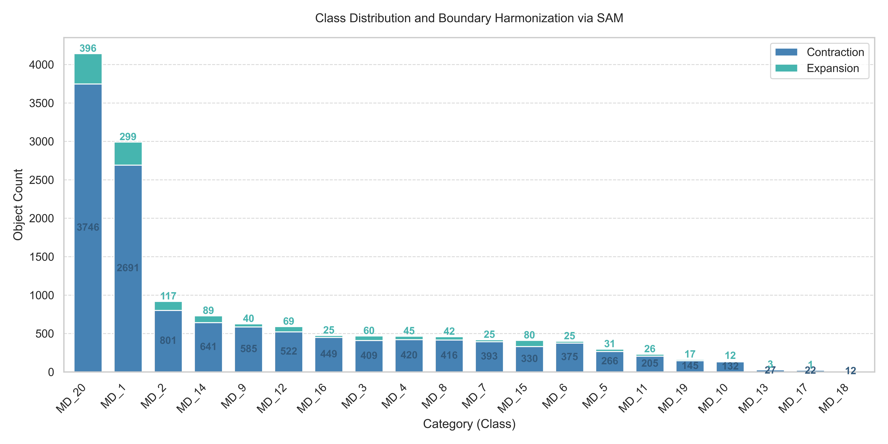
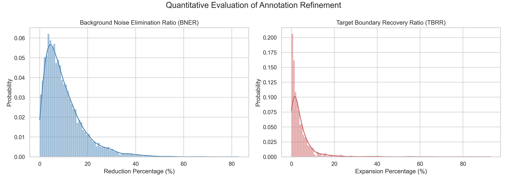
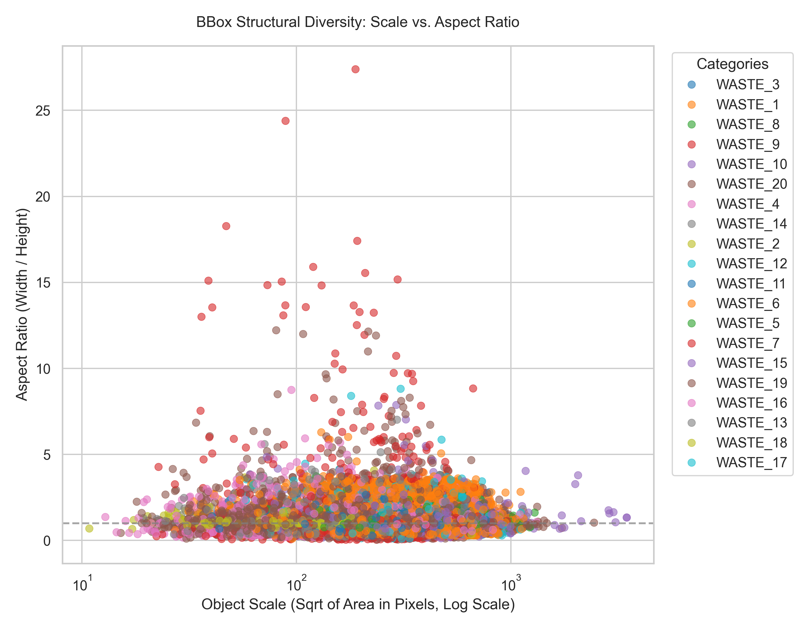
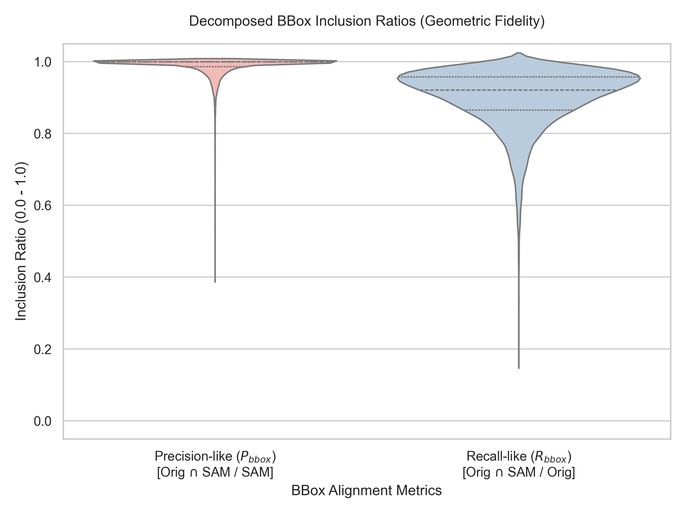
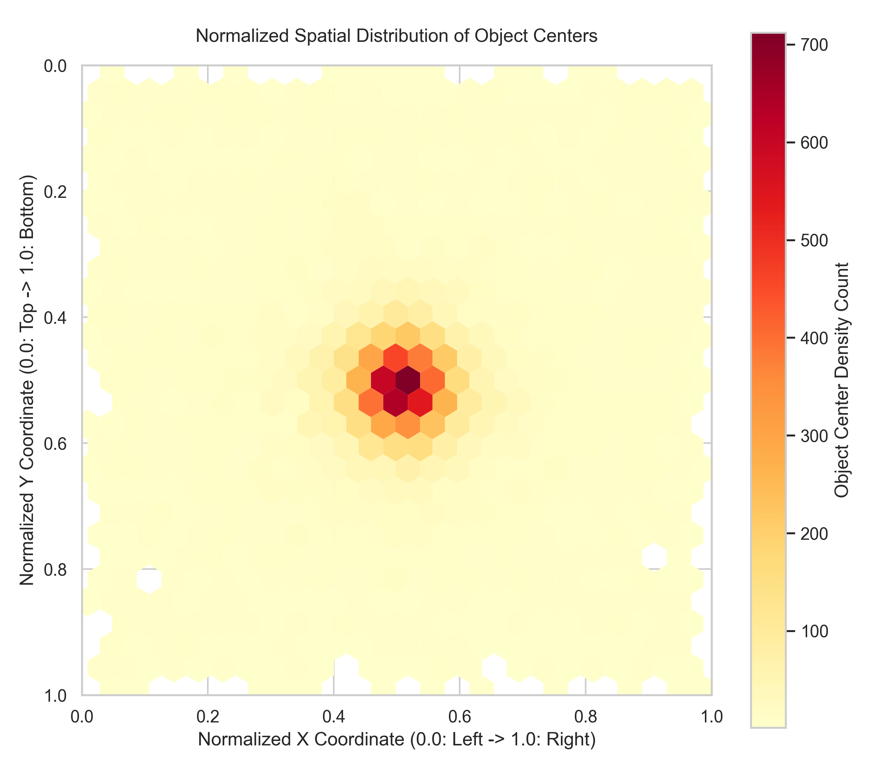
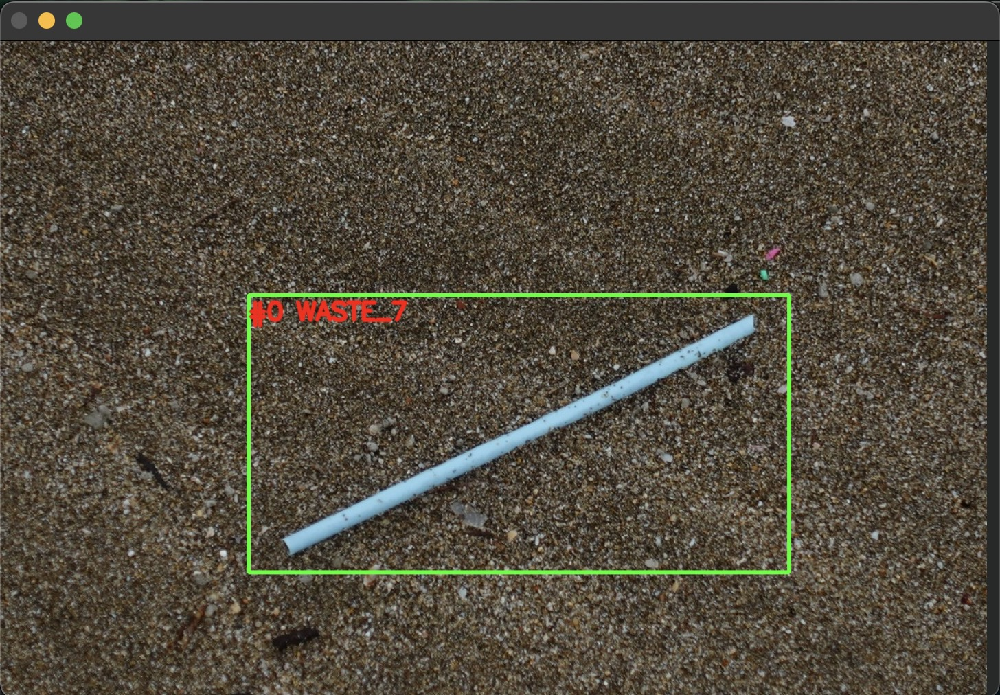
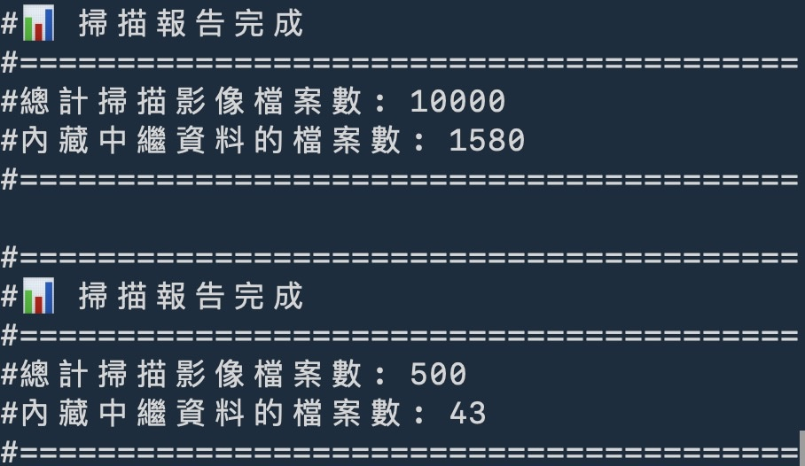

# MDImageNet-CE Script Note
- 2026-06-20 outline

***
## Processing
### [Porcessing_1 : Polygon to bounding box and filename hashing](./script/Processing_1_Parse_Check_org-xml-polygon-points.py)
### [Porcessing_2 : SAM-Derived Bounding Box Harmonization](./script/Processing_2_Refine-BBox_pre_10K-to-refinement_10K-xml_twcc.py)
### 


***
## Dataset format converting

### [Porcessing_3 : Harmonized BBox to PSACAL VOC](./script/Processing_3_BBox2VOC.py)
### Porcessing_4 : VOC to COCO

#### Train
```bash
$ python3 PaddleDetection/tools/x2coco.py \
         --dataset_type voc \
        --voc_anno_dir MD2023_CE/MDCE_VOC/train/Annotations_10K_xml \
        --voc_anno_list MD2023_CE/MDCE_VOC/train/ImageSets/train.txt \
        --voc_label_list MD2023_CE/MDCE_VOC/label_list.txt \
        --voc_out_name MD2023_CE/MDCE_VOC/MDCE_COCO_train.json
```

#### Validation
```bash
$ python3 PaddleDetection/tools/x2coco.py \
         --dataset_type voc \
        --voc_anno_dir MD2023_CE/MDCE_VOC/evl/Annotations_500_xml \
        --voc_anno_list MD2023_CE/MDCE_VOC/evl/ImageSets/val.txt \
        --voc_label_list MD2023_CE/MDCE_VOC/label_list.txt \
        --voc_out_name MD2023_CE/MDCE_VOC/MDCE_COCO_evl.json
```


### Porcessing_5 : COCO to YOLO

```python
from ultralytics.data.converter import convert_coco
# convert_coco：把 COCO JSON 轉成 YOLO TXT 格式，並放在 ./coco_converted/
convert_coco(
    labels_dir="/home/USER/Data/MD2023_CE/MDCE_COCO/annotations/",
    use_segments=False,   # 如果只是目標檢測(BBox)，請設為 False。
    cls91to80=False,      # 客製化資料時防止腳本去尋找不存在的91類映射。
)
```


***
## Visualization
### [VisProcess_1 : Change VOC XML classes name](./script/process_2_rename_voc_xml_class_name.py)
### [VisProcess_2 : XML to CSV for BBox statistics](./script/process_3_xml2csv_BBos-statistics.py)
### [VisProcess_3 : CSV GT and SAM BBox plot](./script/process_4_CSV_BBox_plot_class-MD_##.py)
#### GT and SAMBbox ploting example


### [VisProcess_4 : Dataset EDA plot](./script/process_5_dataset_eda_plots.py)
### MD classes (Exp/Con)


### Quantitative Evaluation of Annotation harmonize


### BBox Structural Diversity: Scale vs. Aspect Ratio


### Decomposed BBox Inclusion Ratios


### Normalized Spatial Distribution of Object Centers



***
## Model Training
### MS COCO with RF-DETR
```python
from rfdetr import RFDETRMedium, RFDETRSmall
model = RFDETRMedium()
model.train(dataset_dir="MDCE_COCO/", epochs=100, lr=1e-4)
```

#### RF-DETRs
#### RF-DETRm
#### map log

### YOLO with YOLO
```python
from ultralytics import YOLO
model = YOLO("yolo11n.pt")
model.train(data="MDCE_YOLO/data.yaml", epochs=100,  imgsz=640) 
```

#### YOLOv11n
#### YOLO26n
#### YOLO26x
#### map log


*** 
## Check
### some check scripts...

#### [Check BBox of single image from original pre_10K.xml.](./script/Check_Draw_xml_4points_annotations_for-TLBR2points.py)



#### [Check image exif and compression](./script/Check_image_exif_dir.py)


